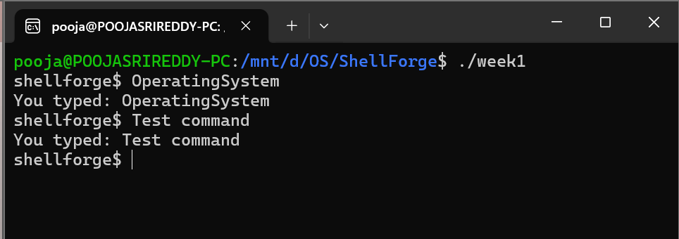
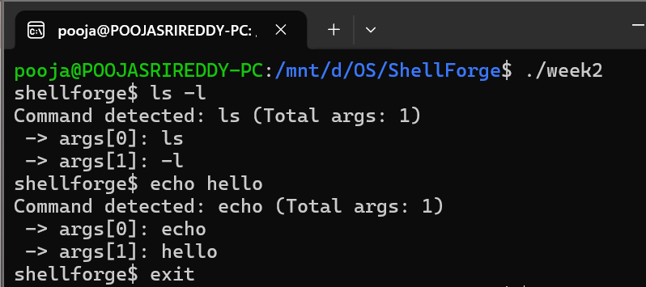
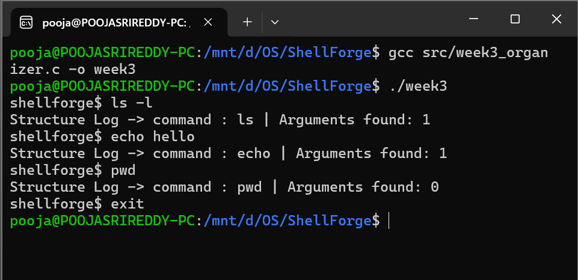
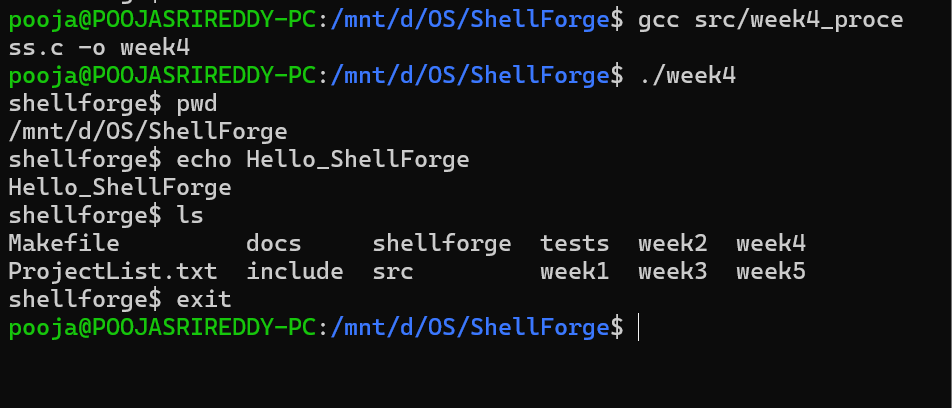
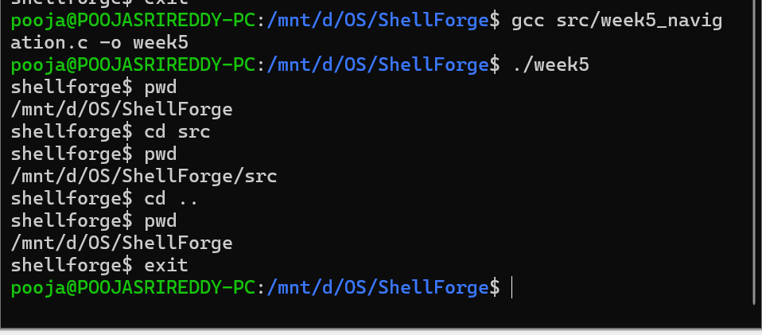

# ShellForge

ShellForge is a mini Unix-like command-line shell developed in C as an Operating Systems and System Programming project.

## Overview

The project is organized into five milestones, with each milestone maintained as a separate C source file. The implementation progresses from a basic interactive shell loop to command parsing, process execution, and built-in directory navigation.

## Project Structure

```
ShellForge/
├── src/
│   ├── week1_repl.c
│   ├── week2_tokenizer.c
│   ├── week3_organizer.c
│   ├── week4_process.c
│   └── week5_navigation.c
├── include/
├── tests/
├── docs/
├── Makefile
├── ProjectList.txt
└── README.md
```

## Milestones

| Week | Milestone | Source File |
| --- | --- | --- |
| 1 | REPL loop using `getline()` with clean exit | `src/week1_repl.c` |
| 2 | Argument lexer and tokenizer using `strtok()` | `src/week2_tokenizer.c` |
| 3 | Command organization using a `Command` structure | `src/week3_organizer.c` |
| 4 | Process execution using `fork()`, `execvp()`, and `waitpid()` | `src/week4_process.c` |
| 5 | Built-in `cd` command using `chdir()` | `src/week5_navigation.c` |

## How to Compile and Run

All programs can be compiled individually with GCC.

### Week 1
```bash
gcc src/week1_repl.c -o week1
./week1
```

### Week 2
```bash
gcc src/week2_tokenizer.c -o week2
./week2
```

### Week 3
```bash
gcc src/week3_organizer.c -o week3
./week3
```

### Week 4
```bash
gcc src/week4_process.c -o week4
./week4
```

### Week 5
```bash
gcc src/week5_navigation.c -o week5
./week5
```

## Output Screenshots

### Week 1 — REPL Loop

The shell accepts input through `getline()` and exits through the `exit` command.



### Week 2 — Tokenizer

The shell separates the command and its arguments using `strtok()`.



### Week 3 — Command Organizer

The parsed command is stored and organized using the `Command` structure.



### Week 4 — Process Execution

Commands are executed using `fork()`, `execvp()`, and `waitpid()`.



### Week 5 — Directory Navigation

The built-in `cd` command changes the shell's working directory using `chdir()`.



## Tools and Technologies

- C
- GCC
- Linux / Ubuntu (WSL)
- POSIX system calls
- Git and GitHub

## Status

All five planned ShellForge milestones are implemented, compiled, executed, and documented with terminal output screenshots.
